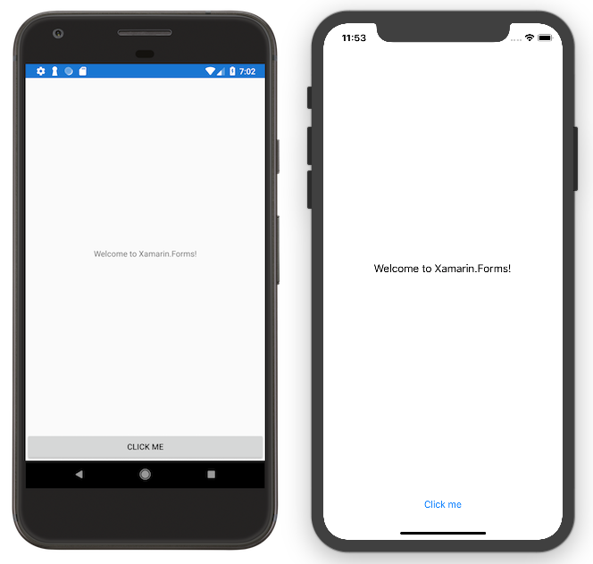

Jacob's adaptation of Xamarin's Xamarin.Forms FirstApp
======

Jacob's adaptation of [sample code](https://github.com/xamarin/xamarin-forms-samples/tree/master/GetStarted/FirstApp) for the [get started page and video](https://docs.microsoft.com/xamarin/xamarin-forms/get-started/first-app/), that shows how to build a basic Xamarin.Forms app from the **File > New** template in Visual Studio.

Modifications made for educational purposes as part of AlgoHobbyGroup.

Original look...

